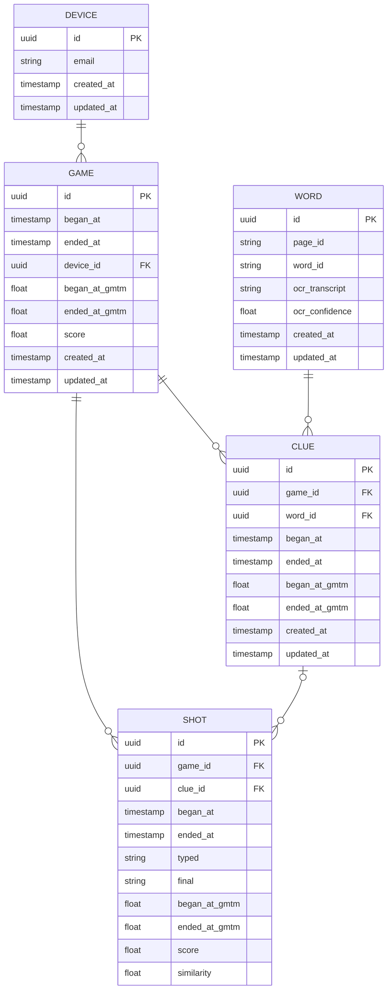

# `oetzit`: dataset

This repo contains the dataset gathered by the deployment of `oetzit` at https://eurac.itch.io/oetzit up to 2024-01-15, in the form of CSV tables for the following five entities: devices, games, words, clues and shots.

## Schema

We lists all properties of all entities and illustrate their relationships with the following ERD diagram.

## Entities

We now spell out the meaning of all entities and their non-obvious properties.

We omit `id` (which is always a UUID used as a primary key).
We also omit `created_at` and `updated_at`, timestamps marking creation and updates of the database record.

**WORDS** represent words recognized by an OCR process:

- `page_id`: id of the source page
- `word_id`: id of the word box within the source page
- `ocr_transcript`: output of the OCR transcription
- `ocr_confidence`: confidence level of the OCR transcription

**DEVICES** represent unique devices the game is played on:

- `email`: optional email for users to be recognied (anonymized as random UUIDs)

**GAMES** represent... well, games:

- `device_id`: id of the device the game is played on
- `began_at`: timestamp marking when game began
- `ended_at`: timestamp marking when game ended
- `began_at_gmtm`: value of internal game clock when game began
- `ended_at_gmtm`: value of internal game clock when game ended
- `score`: score obtained by the player

**CLUES** represent words the user needs to take a shot at guessing before they expire:

- `game_id`: id of the game the clue belongs to
- `word_id`: id of the word the user is meant to guess
- `began_at`: timestamp marking when clue began
- `ended_at`: timestamp marking when clue ended
- `began_at_gmtm`: value of internal game clock when clue began
- `ended_at_gmtm`: value of internal game clock when clue ended

**SHOTS**:

- `game_id`: id of the game the shot belongs to
- `clue_id`: id of the clue the shot is matched to (if any)
- `began_at`: timestamp marking when input began
- `ended_at`: timestamp marking when input ended
- `typed`: string with full input, e.g. 'helol\b\blo\n'
- `final`: string with normalized input, e.g. 'hello'
- `began_at_gmtm`: value of internal game clock when input began
- `ended_at_gmtm`: value of internal game clock when input began
- `score`: score obtaine by the player
- `similarity`: similarity score with matched clue
